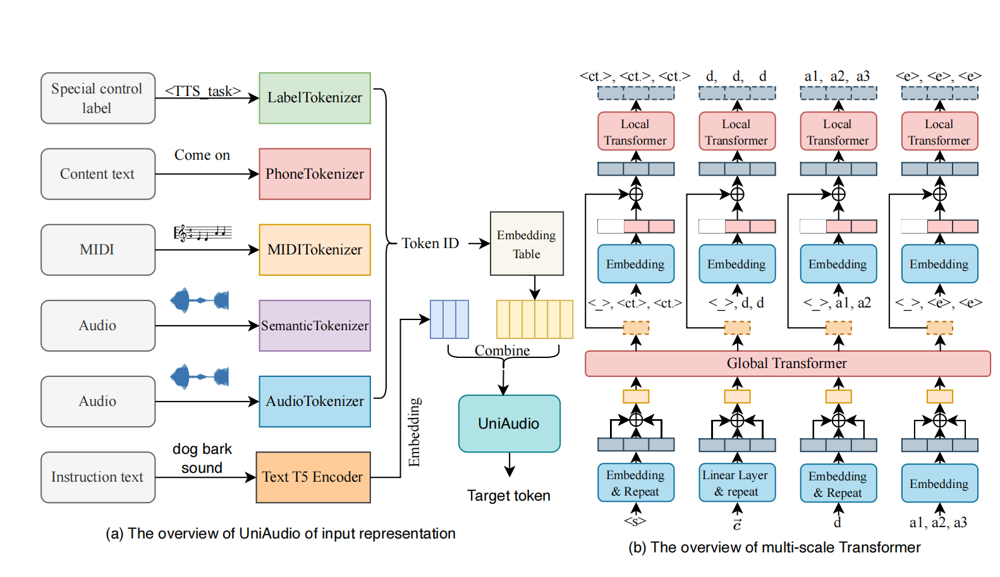
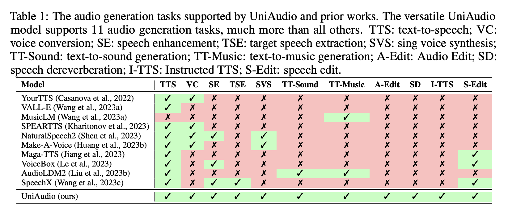

# UniAudio: An Audio Foundation Model Toward Universal Audio Generation

Demo pages can refer to: http://dongchaoyang.top/UniAudio_demo/  
Paper: https://arxiv.org/pdf/2310.00704.pdf

#### Overview
UniAudio is a universal audio generation model, which can solve a lot of audio generation task with one model, such as TTS, VC, Singing voice synthesis, speech enhancement, speech extraction, text-to-sound, text-to-music, speech edit, audio edit, instructed TTS, and speech dereverberation. In the following, the details of UniAudio will be introduced.  
- Neural Audio Codec Models
- Top-level Design
- Training own UniAudio for any task with your own dataset.

The more details will be updatad.

## Abstract
Language models (LMs) have demonstrated the capability to handle a variety of generative tasks. This paper presents the UniAudio system, which, unlike prior task-specific approaches, leverages LMs techniques to generate multiple types of audio (including speech, sounds, music, and singing) with given input conditions. 
UniAudio 1) first tokenizes all types of target audio along with other condition modalities, 2) concatenates source-target pair as a single sequence, and 3) performs next-token prediction using LMs. Also, a multi-scale Transformer model is proposed to handle the overly long sequences caused by the residual vector quantization based neural codec in tokenization. Training of UniAudio is scaled up to 165K hours of audio and 1B parameters, based on all generative tasks, aiming to obtain sufficient prior knowledge not only in the intrinsic properties of audio but also the inter-relationship between audio and other modalities. Therefore, the trained UniAudio model has the potential to become a foundation model for universal audio generation: it shows strong capability in all trained tasks and can seamlessly support new audio generation tasks after simple fine-tuning. Experiments demonstrate that UniAudio achieves state-of-the-art or at least competitive results on most of the 11 tasks. Demo and code are released.
The overview of UniAudio as following picture shows.

The task comparison between previous works.

In the following, we will show some generated samples by our proposed method. 

### Neural Audio Codec Models
Please refer to codec folder to find the training codec of Neural Audio Codec.

### Top-level Design
The framework of UniAudio is very simple and useful. It includes 4 steps: (1) define your task. (2) prepare data. (3) tokenize data and save it as .pth file. (4) Training and inference

### Using UniAudio framework to do any audio related tasks
Excepting the 11 tasks presented in the paper, UniAudio also can other tasks, e.g. ASR, speaker verification, audio classification, ans so on. But the performance of these tasks are not very good comparaed with other SOTAs. 

