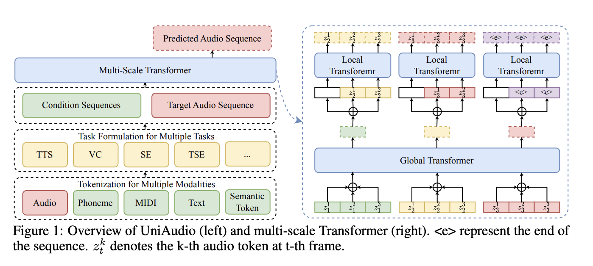

# UniAudio: An Audio Foundation Model Toward Universal Audio Generation
### News
This paper has been accepted by ICML 2024. We plan to release the checkpoints (we name it as Open-UniAudio) in the next few days. Our plans includes:
- Provides all of task recipes
- Provides a new and better audio codec for UniAudio
- Provides the checkpoints of pre-training UniAudio, compared to paper's reported training data, we plan add more sound and music data to train the open UniAudio.

If you are interested in Open-UniAudio, welcome to contact us! 

## Overview
Demo page: http://dongchaoyang.top/UniAudio_demo/ <br>
paper: https://arxiv.org/pdf/2310.00704.pdf <br>
UniAudio is a universal audio generation model, which can solve a lot of audio generation task with one model, such as TTS, VC, Singing voice synthesis, speech enhancement, speech extraction, text-to-sound, text-to-music, speech edit, audio edit, instructed TTS, and speech dereverberation. In the following, we will give the details of UniAudio. UniAudio supports user to define any task, we expect more researcher can join us. <br>
- Neural Audio Codec Models: The whole training code for neural audio codec models
- Top-level Design: How to design a framework that support users to define their tasks.
- Training own UniAudio for any task with your own dataset: The details of training process

The overview of UniAudio as following picture shows.



The more details will be updatad soon.

## Neural Audio Codec Models
Please refer to codec folder to find the training codec of Neural Audio Codec. 

## Top-level Design
The framework of UniAudio is very simple and useful. It includes 4 steps: (1) define your task. (2) prepare data. (3) tokenize data and save it as .pth file. (4) Training and inference


## Training the UniAudio
We give an example of UniAudio to train TTS in LibriTTS
### Environment 
Firstly, create environment for UniAudio.
```
conda create -n uniaudio python=3.8
conda init
source ~/.bashrc
conda activate uniaudio
```
Then:
```
cd UniAudio
bash requirements.sh
bash UniAudio/download.sh
```
### TTS example
#### Define the task
You can define the task format in the utils/task_definition.py
```
tts_format = {
    'keys': ["phone_seq", "prompt_seq", "audio_seq"],
    'type': ["phone", "audio_prompt", "audio"],
    'features': [],
    'loss_key': 'audio_seq',
}
```
After that, the dataloader of UniAudio will combine the phone_seq and audio_seq as one single sequence based on your definition, so that LM can process it.
#### Prepare Dataset
We give an example to prepare data with LibriTTS. Firstly, you should download the dataset.
```
wget https://www.openslr.org/resources/60/train-clean-100.tar.gz
wget https://www.openslr.org/resources/60/train-clean-360.tar.gz
wget https://www.openslr.org/resources/60/test-clean.tar.gz # for evaluation
wget https://www.openslr.org/resources/60/train-other-500.tar.gz
tar -zxvf train-clean-100.tar.gz
tar -zxvf train-clean-360.tar.gz
tar -zxvf test-clean.tar.gz
tar -zxvf train-other-500.tar.gz
```
Secondly, please prepare the ```wav.scp``` file based on your data path, see ```UniAudio/egs/TTS/data/train/wav.scp``` find the format of wav.scp. <br>
Thirdly, you should prepare the phone.scp file, an example can be found in ```UniAudio/egs/TTS/data/train/phone.scp``` <br>
You can use ```UniAudio/tools/tokenizer/phone/text_tokenizer.py``` to get the phone.scp. <br>
Third, prepare utt2spk file, see an example in ```UniAudio/egs/TTS/data/train/utt2spk```   <br>
After that, put your ```wav.scp, phone.scp and utt2spk``` into ```UniAudio/egs/TTS/data/train folder```, similarly, you also should prepare the val set in ```UniAudio/egs/TTS/data/val``` folder <br>

Lastly, tokenize the audio and phone into tokens. Note that, you should set the number of GPUs, you want to use.
```
cd UniAudio/egs/TTS
bash run.sh --stage 2 --stop_stage 4
```
The details of annotation can be found in run.sh <br>

#### Train TTS task with UniAudio
```
cd UniAudio/egs/TTS
bash run.sh --stage 5 --stop_stage 5
```

#### Inference
```
cd UniAudio/egs/TTS
bash run.sh --stage 6 --stop_stage 6
```

### Using UniAudio framework to do more audio related tasks
In previous section, we give the details of how to train a TTS task with UniAudio. In the future, we will try to give more tasks's details, including: <br>
- TTS in LibriLight 
- VC in Librilight
- SE 
- TSE
- Text-to-sound and music
- Sing Voice Generation

Excepting the 11 tasks presented in the paper, UniAudio also can other tasks, e.g. ASR, speaker verification, audio classification, and so on. But the performance of these tasks still has gap with other SOTAs. 

### Training All of Tasks using one model
It is easy to train all of tasks using UniAudio, when differnt tasks of data has ready.

### Todo

- [x] The first version of UniAudio, give an example to train TTS task in LibriTTS dataset.
- [ ] Add more task into egs 
- [ ] Give more comprehensive documentation for UniAudio
- [ ] Combine all of task
- [ ] Give scripts to simulate speech enhancement and target speaker extraction data.
- [ ] Give more detailed information for evaluation scripts.

### Citation
If you find this code useful in your research, please cite our work and give us a star
```bib
@article{yang2023uniaudio,
  title={UniAudio: An Audio Foundation Model Toward Universal Audio Generation},
  author={Dongchao Yang, Jinchuan Tian, Xu Tan, Rongjie Huang, Songxiang Liu, Xuankai Chang, Jiatong Shi, Sheng Zhao, Jiang Bian, Xixin Wu, Zhou Zhao, Helen Meng},
  journal={arXiv preprint arXiv:2310.00704},
  year={2023}
}
```

### Contact us
If you have any problem about the UniAudio code, please contact Dongchao (dcyang@se.cuhk.edu.hk) or Jinchuan (jinchuat@andrew.cmu.edu). 

### License
All of code is finished by Dongchao and Jinchuan. You can use the code under MIT license.
